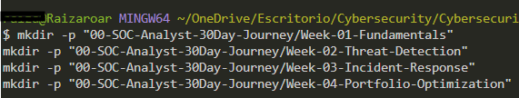

# Lab 1.1.1: Professional Environment Integration

## Project Overview

Integration of 30-day SOC Analyst training program with existing cybersecurity portfolio structure. This lab establishes the documentation framework and workflow for the intensive training period.

## Tools Used
- **Git/GitHub**: Version control (already configured)
- **Visual Studio Code**: Documentation platform
- **Existing Portfolio Structure**: Professional categorization by security domain

## Objective

- Integrate training plan with existing portfolio
- Create progress tracking mechanism
- Establish daily documentation workflow
- Optimize portfolio visibility for HR

## Lab Environment

- **Portfolio Location:** `~/OneDrive/Escritorio/Cybersecurity/Cybersecurity-Portafolio-Raiza`
- **Existing Structure:** 8 domain-based folders
- **Git Status:** [Corre: `git status` y pon el resultado]
- **VS Code Version:** [Help > About]

## Prerequisites

- Existing GitHub portfolio
- Git configured
- VS Code installed
- Portfolio structure already organized

---

## Executive Summary

This lab successfully integrated a structured 30-day training program into an existing professional cybersecurity portfolio. By creating a dedicated tracking system (`00-SOC-Analyst-30Day-Journey`) and updating the main README for HR visibility, the portfolio now serves as both a learning journal and a demonstration of active skill development.

**Key Achievement:** Transformed existing portfolio into a dynamic learning showcase without disrupting established structure.

---

## Step-by-Step Implementation

### Step 1: Portfolio Analysis

**Action:** Reviewed existing structure and identified integration points

**Current Structure Strengths:**

- Domain-based organization (industry standard)
- Multiple security areas covered
- Professional naming conventions
- Assets properly separated

**Integration Strategy:**

- Create `00-` prefixed folder for visibility
- Map labs to existing domains
- Add progress tracker for accountability

---

### Step 2: Training Folder Creation

**Commands Used:**

```bash
cd ~/OneDrive/Escritorio/Cybersecurity/Cybersecurity-Portafolio-Raiza
mkdir -p "00-SOC-Analyst-30Day-Journey/Week-01-Fundamentals"
mkdir -p "00-SOC-Analyst-30Day-Journey/Week-02-Threat-Detection"
mkdir -p "00-SOC-Analyst-30Day-Journey/Week-03-Incident-Response"
mkdir -p "00-SOC-Analyst-30Day-Journey/Week-04-Portfolio-Optimization"
```




**Justification:**

- `00-` prefix: Alphabetically first 
- Weekly breakdown: Clear progress milestones
- Separate from domains: Distinguishes active training from past projects

**Alternative Considered:** Distribute all labs directly into domain folders
**Why Not:** Loses narrative of "30-day journey"; harder to track progress

---

### Step 3: Progress Tracker Creation

**File Created:** `00-SOC-Analyst-30Day-Journey/PROGRESS-TRACKER.md`

**Key Components:**

- Daily log 
- Skills development matrix
- Achievement milestones 

**Justification:**

- Demonstrates commitment 
- Shows growth over time 
- Provides quick overview for busy recruiters

---

### Step 4: README Enhancement

**Modification:** Added 30-day training banner to main README

**Justification:**

- First impression optimization
- Shows active development (not stale portfolio)
- Direct link to progress (reduces HR friction)

**Alternative:** Keep training hidden in subfolders
**Why Not:** Misses opportunity to showcase active learning

---

### Step 5: Lab Distribution Planning

**Strategy:** Map future labs to existing domain folders

**Example Mapping:**
- Log analysis labs → `04-SIEM-Projects`
- Network analysis → `01-Network-Security`
- Forensics labs → `05-Forensics`
- Scripts → `06-Automation-Scripts`

**Justification:**

- Integrates new work with existing portfolio
- Builds depth in each domain
- Demonstrates comprehensive skills

---

## Challenges Encountered

1. **Challenge:** Integrating without disrupting existing structure
   **Solution:** Created separate `00-` folder for training narrative while linking to domain folders

---

## Commands Reference

```bash
# Navigation
cd ~/OneDrive/Escritorio/Cybersecurity/Cybersecurity-Portafolio-Raiza

pwd                          # Verify location

# Structure creation
mkdir -p "folder/subfolder"  # Create nested folders

# Git workflow
git status                   # Check current state
git add .                    # Stage all changes
git commit -m "Day 1: Environment integration for 30-day training"
git push origin main         # Sync to GitHub

# VS Code
code .                       # Open current folder
```

---

## Lessons Learned

1. **Portfolio as Living Document:** A portfolio should evolve with your learning
2. **HR-First Thinking:** Structure matters for recruiter navigation
3. **Daily Documentation:** Committing daily creates visible momentum
4. **Integration > Isolation:** New projects should enhance, not compete with existing work

---

## Conclusion

Successfully prepared professional environment for 30-day SOC Analyst intensive training. The portfolio now serves dual purposes:

1. **Archive:** Showcases past projects by domain
2. **Journal:** Documents active learning journey

**Readiness Indicators:**

- Progress tracking system active
- Documentation workflow established
- HR visibility optimized
- Ready for Day 2 technical labs

---


## References
- [Effective Technical Portfolios for Cybersecurity](https://www.sans.org/blog/)
- [GitHub Best Practices](https://github.com/github/gitignore)
- [Markdown Guide](https://www.markdownguide.org/)

---

**Completed:** 16-01-2026  
**Time Invested:** 3 hours  
**Difficulty:** Beginner  
**Status:** ✅ COMPLETE

---