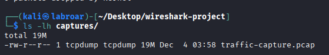
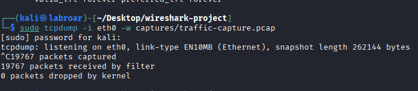
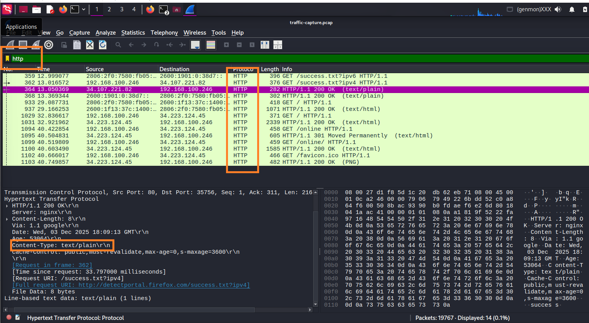
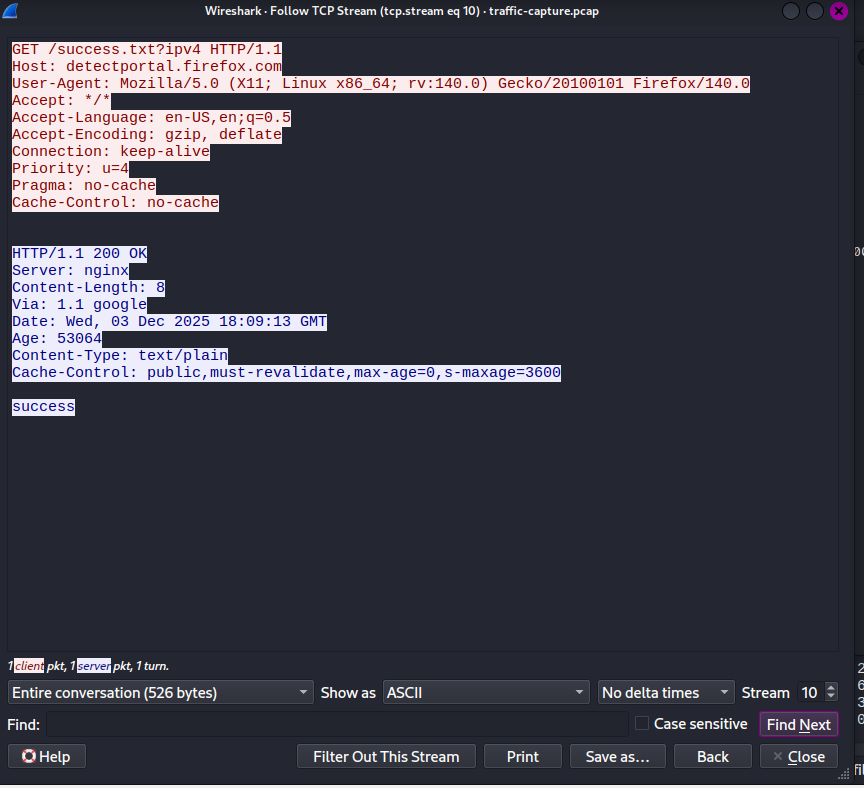
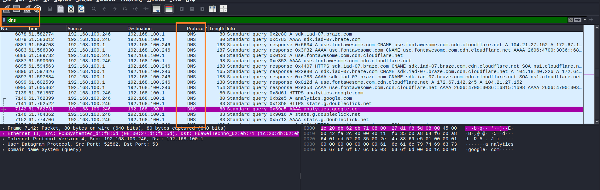
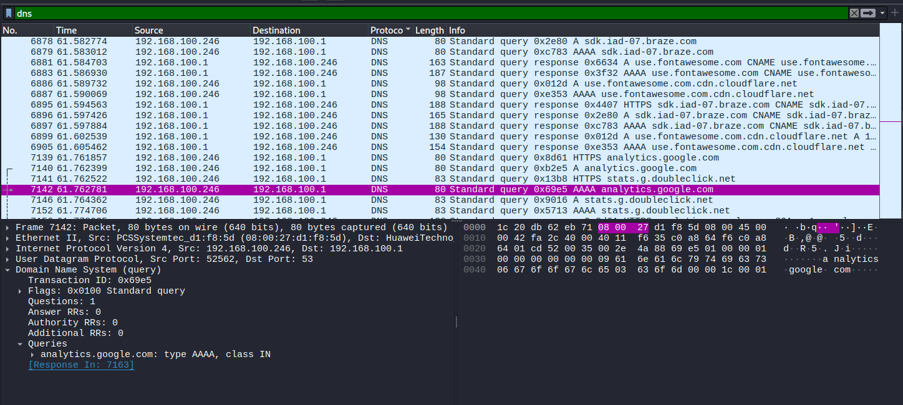
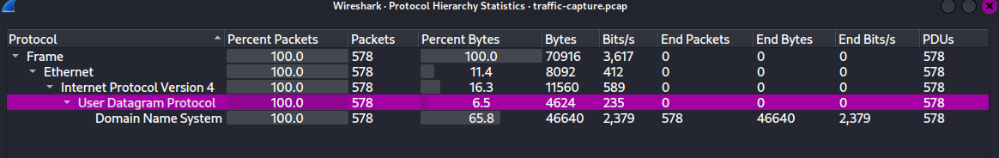

# Network Traffic Analysis with Wireshark

## Project Overview

This project demonstrates fundamental network traffic analysis skills using Wireshark. The analysis focuses on identifying common protocols, understanding packet structures, and detecting potential security issues in captured network traffic.

Duration: 2-3 hours
Difficulty: Entry Level
Platform: Kali Linux 2025.2-virtualbox-amd64

Tools Used:

- Wireshark (GUI analysis)
- tcpdump (packet capture)
- tshark (CLI analysis)
- capinfos (statistics)
- Linux command line utilities

Objectives

1. Capture live network traffic using Wireshark
2. Analyze common protocols (HTTP, DNS, TCP, ICMP)
3. Identify normal vs suspicious network behavior
4. Extract relevant information from packet captures
5. Document findings in a professional format

-**Lab Environment**

 System Information

OS: Kali Linux 2025.2-virtualbox-amd64

Wireshark Version: 4.2 (pre-installed in Kali)

Network Interface: eth0 / wlan0

Capture Duration: 5-10 minutes per scenario

-**Prerequisites**

Kali Linux VM or bare metal installation

Root/sudo privileges

Basic understanding of TCP/IP and Linux CLI

Network connectivity for packet capture

## Wireshark Traffic Analysis - Detailed Report

Analyst: Raiza Rosas Aguilar
Date: 15-11-25
Duration: 10 minutes
Total Packets: [1967]

## Executive Summary

This report documents the analysis of network traffic captured during a 10-minute session. The analysis focused on identifying common protocols, understanding data flow, and detecting potential security concerns.
Key Findings:

- HTTP traffic exposes unencrypted data including URLs and cookies
- DNS queries reveal browsing patterns
- TCP connections established successfully with proper handshakes
- No malicious activity detected during capture period

 Methodology
Capture Setup

Platform: Kali Linux 2025.2-virtualbox-amd64

Tool: Wireshark 4.2 / tcpdump / tshark

Interface: eth0 (Ethernet) / wlan0 (Wireless)

## Capture Command

```bash
sudo tcpdump -i eth0 -w http-traffic-analysis.pcap
```

Filter: None (captured all traffic)
File Size:  19 MB
Location: captures/http-traffic-analysis.pcap



## Analysis Approach

Initial packet review using Wireshark GUI

CLI analysis with tshark for automation

Protocol-specific filtering (HTTP, DNS, TCP)

Stream following for context

Statistical analysis with capinfos

Security assessment

## Traffic Analysis Results

- **HTTP Traffic Analysis**
 Filter Used: http
Observations:

Captured 1967 HTTP Packets



- All requests to <http://neverssl.com>
- User-Agent: Mozilla/5.0 (identifying browser)
- HTTP Methods observed: GET, POST



## Security Implications

- Unencrypted traffic exposes sensitive data
- Passwords transmitted in clear text
- Session hijacking vulnerability



## Scenario 2: DNS Query Analysis

- Objective: Examine DNS resolution process
*Key Findings:*

1. Captured DNS queries and responses
2. Identified DNS servers used
3. Analyzed query types (A, AAAA, CNAME, MX)
4. Observed time-to-live (TTL) value



- The domain you queried (example: google.com)
- The type of query (A, AAAA)
- The response (the IP)



## Statistics

1. All the protocols I captured
2. How many packets of each
3. Percentage of each protocol



## Capinfos

```bash
capinfos captures/traffic-capture.pcap 
```


## Automatically extract HTTP requests

```bash
 tshark -r captures/traffic-capture.pcap -Y http.request -T fields -e http.host -e http.request.uri    
```

**Explicación:**

- `tshark` = Wireshark en modo texto
- `-r` = read (leer archivo)
- `-Y http.request` = filtro (solo peticiones HTTP)
- `-T fields` = mostrar campos específicos
- `-e http.host` = el dominio
- `-e http.request.uri` = la ruta (URL)


We also extract DNS queries.

```bash
tshark -r captures/traffic-capture.pcap -Y dns.qry.name -T fields -e dns.qry.name | sort | uniq > reports/dns-queries.txt
```

We convert it into a .txt file for analysis.


Por ultimo, revisamos nuestros archivos .txt para observar su contenido de logs


## Summary

- The analysis carried out with Wireshark provided a practical understanding of how packets circulating on a network are captured, interpreted, and classified. Key points were highlighted throughout the conversation:

1. Total traffic visibility: Wireshark provides a detailed view of protocols, IP addresses, ports, and communication flows, making it easy to identify normal patterns and anomalies.
2. Filtering and segmentation: The use of filters is essential to isolate relevant traffic (HTTP, DNS, TCP, etc.) and avoid information overload.
3. Security application: The tool is essential in cybersecurity environments, as it allows for the detection of intrusion attempts, suspicious connections, or unauthorized transfers.
4. Educational value: Beyond its professional use, Wireshark is a powerful educational resource for learning how protocols work and reinforcing understanding of network architecture.
