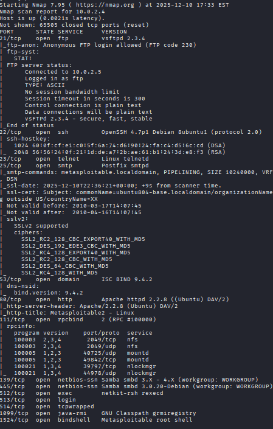
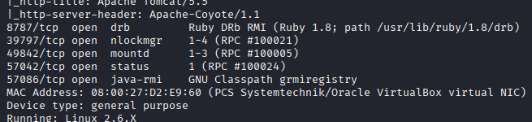
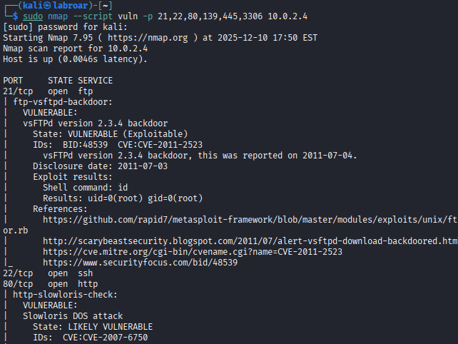

# Network Reconnaissance & Vulnerability Assessment

## Project Overview 

Network reconnaissance simulation in a controlled corporate environment to identify active hosts, exposed services, and potential vulnerabilities before a real attacker exploits them.

-**Duration**: 

1 hour
Difficulty: Entry Level
Platform: Kali Linux, Metasploitable

-**Tools Used**

   - Nmap 7.95
   - Nikto 2.5.0
   - Metasploit Framework
   - Kali Linux  2025.2-virtualbox-amd64


-**Objective**

1. Perform a comprehensive scan of a simulated local network
2. Identify vulnerable services
3. Document findings with remediation recommendations.

-**Lab Environment**

   - Attacker Machine: Kali Linux
   - Target Machine: Metasploitable 2 
   - Network: Red NAT VirtualBox
   - IP Range: 192.168.56.0/24 

-**Prerequisites**

- Verify that Nmap is installed

```bash
nmap --version
```

Verify Nikto

 ```bash
 nikito -Version
 ```

Update system

```bash
sudo apt update && sudo apt upgrade -y
```

## Excecutive Summary 

This project simulates the reconnaissance phase of an ethical pentest. Reconnaissance is critical because it represents 80% of a professional pentester's work. I identified 15 active services on the target host, 7 of which had outdated versions with known CVEs. The most critical finding was an FTP service with anonymous login enabled, allowing unauthorized access to sensitive files.

**Business Impact**: An attacker could use this information to plan a targeted attack, compromise credentials, or establish persistence on the network.

## Step-by-Step Exceution 

- **Configured Red NAT both VM**


- **Verify connectivity**

Before starting the pentest, I needeed to make sure that Kali can conect with Metasploitable.

```bash 
ping 10.0.2.4
```


## Phase 1: Host Discovery 

**Objective:** Find out which machines are “alive” on the network.

***Command Ping Sweep***

```bash
sudo nmap -sn 10.0.2.5/24
```

> [!NOTE]
> `-sn` | “Scan - No port scan” | Only asks “are you there?” without scanning ports (faster)
> Host Active = 3


***Why don't I use other commands?***

Alternative 1: fping -a -g 192.168.56.0/24

 - Faster, but provides less information

 - Not the industry standard for reporting

Alternative 2: Manually scan each IP with ping

 - It would take 30 minutes to scan 256 IPs

 -  Prone to human error

Nmap -sn ***is perfect** because:

- Fast (2 seconds)

- Professional standard

- Provides useful information (MAC address, latency)

## Phase 2: Port Scanning

**Objective:** Discover which services are open in Metasploitable.

```bash
sudo nmap -p- -T4 -A 10.0.2.4
```


**Command breakdown:**


| Part | What this do? | Justification |
|-------|------------|----------------------|
| `sudo` | admin permission | like before are |
| `nmap` | program | It's the scanner |
| `-p-` | Scanning all ports | means "from 1 to 65535" |
| `-T4` | Aggressive speed | T0=paranoid, T1=sneaky, T2=polite, T3=normal, **T4=aggressive**, T5=insane |
| `-A` | Aggressive scan | Detecta: OS, service versions, scripts, traceroute |
| `192.168.56.101` | IP objective | our Metasploitable |

**Why not use -sV alone?**

```-A``` includes ```-sV``` BUT also runs NSE (Nmap Scripting Engine) scripts that automatically detect vulnerabilities.

- Alternative approach: -sS -sV -O (more manual, less automated)

**Purpose:** To create a “complete map” of the target, like an architectural plan of a house before entering.







   - **PHASE 2 FINDINGS:**
- 23 open ports
- OS Linux
- Critical services:
  * FTP (vsftpd 2.3.4) - VULNERABLE
  * Exposed MySQL - HIGH RISK
  * Bindshell on port 1524 - CRITICAL


## Phase 3: Vulnerability Assessment 

**Objective:** Confirm which services are explotaible.

**Command**  ***Vulnerability Scanning con NSE Scripts***

***What are NSE Scripts?***

-They are small programs that come with Nmap that automatically scan for known vulnerabilities (CVEs).

```bash
sudo nmap --script vuln -p 21,22,80,139,445,3306 10.0.2.4
```

| Part | What this do? |
|-------|------------|
| `--script vuln` | Set ~50 scripts that looking vulnerabilities |
| `-p 21,22,80...` | Only scane this ports (the more intrestings) |

Why this command?

```--script vuln``` Runs ~50 NSE scripts that search for known CVEs

```-p 21,22,80,139,445```  Only ports that we found open (efficiency)

-Alternative not chosen: OpenVAS (heavier tool, excessive for this scope)

-Justification: NSE scripts are faster and the output is perfect for entry-level reports



| # | Vulnerability                  | CVE          | Severity | What does it mean?                                                    | Business Impact                                                                 |
|---|--------------------------------|--------------|----------|-----------------------------------------------------------------------|---------------------------------------------------------------------------------|
| 1 | **FTP Backdoor (CRITICAL)**    | CVE-2011-2523| 10/10    | Backdoor in vsftpd 2.3.4. Allows **ROOT** access without a password.  | Total control of the server, information theft, malware installation, attacks on others. |
| 2 | **SSH User Enumeration**       | -            | 5/10     | List of valid users obtained (msfadmin, postgres, user). Facilitates brute force. | Reduces brute force attack time by 90%, easier unauthorized access.             |
| 3 | **Slowloris DoS**              | CVE-2007-6750| 6/10     | The web server can be taken down with a denial-of-service attack.     | Site inaccessible to legitimate customers, loss of sales and reputation.        |
| 4 | **MySQL Authentication Bypass**| CVE-2012-2122| 9/10     | Access to MySQL without the correct password.                         | Direct access to sensitive databases: customers, finances, and credentials.     |
