# Detection and correlation of unauthorized access attempts.

## Project Overview 

This lab simulates a real SOC scenario where we detect multiple failed SSH login attempts on a critical server. You will learn how to correlate events between system logs, Splunk, and ServiceNow to identify and document a potential brute force attack.

-**Duration**: 

1 hour
Difficulty: Entry Level
Platform: Kali Linux,

**Skills demonstrated:**

1. Authentication log analysis
2. Security event correlation
3. Incident management with ServiceNow
4. Query and visualization in Splunk


**Tools Used**

   - Kali Linux  - Analysis and simulation platform
   - Splunk Enterprise - SIEM for log correlation and analysis
   - ServiceNow - Incident management platform (ITSM)
   - SSH - Target service for simulating attacks
   - Hydra - Tool for simulating brute force attacks (for educational purposes)

**Main Objective:**
   - Detect, analyze, and document an SSH brute force attack using data correlation from multiple sources.

**Specific Objectives:**

   - Generate controlled SSH attack traffic.
   - Ingest logs into Splunk for analysis.
   - Create detection queries in Splunk.
   - Document the incident in ServiceNow with evidence.
   - Establish detection metrics (detection time, number of correlated events).

**Lab Environment**
Simulated attacker: Kali Linux (your machine)
Target: SSH server (can be localhost or another VM)
Monitoring: Splunk with Universal Forwarder
Management: ServiceNow (Incident Management)


**Prerequisites**

   - Basic navigation in Linux terminal
   - Basic SSH concepts
   - Understanding what a system log is

Splunk configured to receive SSH logs:

   - Have an active Splunk account 
   - Configure an input to receive logs from ```/var/log/auth.log```


ServiceNow Developer Instance:

   - Create a free account at: https://developer.servicenow.com/
   - Request a personal instance (takes ~30 seconds)


Kali Linux:

Have the following installed **hydra, ssh, curl**

## Phase 1 Preparation of the Environment

**Step 1.1 - Verify/Install tools in Kali**

Open the terminal in Kali and run:

```bash
sudo apt update && sudo apt install -y hydra openssh-server curl
```

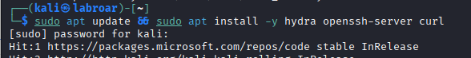

***Why this command?***


```apt update``` Updates the list of available packages
```hydra``` Tool to simulate brute force attacks (controlled)
```openssh-server``` To have an SSH server to attack
```curl``` To make HTTP requests to the ServiceNow API

***Why this path?***

 I needee both the attacker (Hydra) and the target (SSH server) on the same machine for a controlled and secure lab.

**Step 1.2 - Start SSH service**

```bash
sudo systemctl start ssh
sudo systemctl status ssh
```

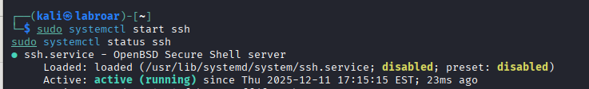

***Why this command?***

```systemctl start ssh``` Starts the SSH service on my Kali

```systemctl status ssh``` Verifies that it is running correctly

**Step 1.3 Create test user**

```bash
sudo useradd -m testuser
echo “testuser:SecurePass123!” | sudo chpasswd
```

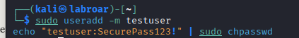

***Why this command?***

```useradd -m``` Creates a new user with home directory

```chpasswd``` Sets the password securely

```-m``` flag Creates a “home” directory for the user

### Technical Challenge: Bash Special Characters

**Initial attempt failed due to:**

- The `!` character triggers history expansion in bash when using double quotes

- Error: `Authentication token manipulation error`

**Solution implemented:**
Used escape character `\` to treat `!` as literal:

```bash
echo "testuser:SecurePass123\!" | sudo chpasswd
```

**Alternative approaches considered:**

1. Single quotes: `echo 'testuser:SecurePass123!'` (simplest)
2. Interactive: `sudo passwd testuser` (most secure)
3. Escape character: `\!` (chosen for automation capability)

**Why this matters:**
Understanding shell metacharacters is critical for:

- Writing secure automation scripts
- Avoiding command injection vulnerabilities
- Proper password handling in scripts

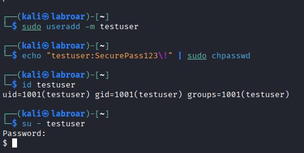

## PHASE 2: Configure Splunk to Receive Logs 

**Step 2.1 - Configure input in Splunk**

This is importan because:

   - Linux logs are stored in text files in /var/log/.
   - Splunk is a SIEM that “reads” these files and converts them into searchable events.
   - Without this configuration, Splunk does NOT know which files to monitor.

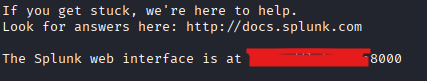

```bash
sudo /opt/splunk/bin/splunk add monitor /var/log/auth.log -index main -sourcetype linux_secure -hostname kali-lab
```

1. ```sudo /opt/splunk/bin/splunk```  Splunk executable with elevated permissions

2. ```add monitor``` Adds a new “monitor” type input and  **What is monitor?:** Splunk “watches” the file in real time, Every time a new line is written, Splunk reads it immediately

3. ```/var/log/auth.log``` The path to the file to be monitored and  This is the “data source”

4. ```-index main```  It is like a “database” or “container” for events and  Splunk organizes data into separate indexes

   - If I do not specify it, Splunk uses “default”

   - It is best practice to be explicit

5. ```-sourcetype linux_secure``` It tells Splunk HOW to interpret the data and Each type of log has a different format because  Splunk needs to know the format in order to parse it correctly

```linux_secure```  It is Splunk's predefined sourcetype for Linux authentication logs and Splunk already knows how to extract fields (timestamp, user, action, etc.) from this format

6. ```-hostname kali-lab``` Assigns a “friendly name” to the host that generates the logs and it's important to change it because  In companies, you have 100+ servers and Descriptive names help you quickly identify them

- `kali-lab` is clearer than just “kali”

**COMMAND VERIFICATION**

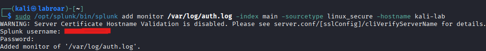

**STEP 2.5: Verify that Splunk is receiving data**


Navigate to Search & Reporting and In the search bar, run this query:

```spl
index=main sourcetype=linux_secure earliest=-5m
```

BREAKDOWN OF THE SPL QUERY:

SPL = Splunk Processing Language
Basic syntax: ```field=value``` ```field2=value2```
Query part by part:

1. ```index=main```

***What it does*** Searches only in the “main” index

***Why*** Limits the search scope (faster) Without this, Splunk would search ALL indexes

2. ```sourcetype=linux_secure```

***What it does*** Filters only events that are Linux authentication logs

***Why*** There could be other data in main (web logs, application logs, etc.)

***Implicit operator*** When you set multiple conditions, the default operator is AND.

***Equivalent*** index=main AND sourcetype=linux_secure

3. ```earliest=-5m```last 5 minutes

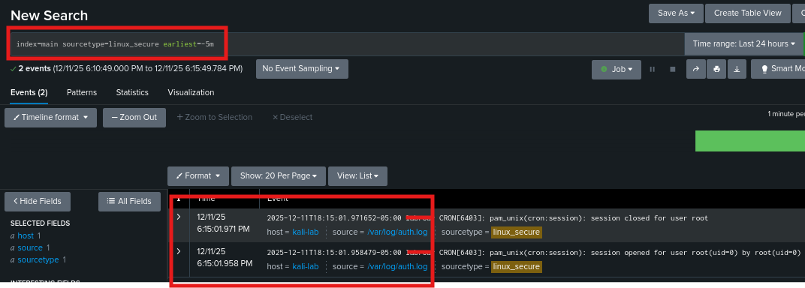

**STEP 2.6: Generate Test Events**

***Why generate test events?***

- To CONFIRM that Splunk is reading in real time
- Create controlled test data
- Verify that the entire pipeline is working

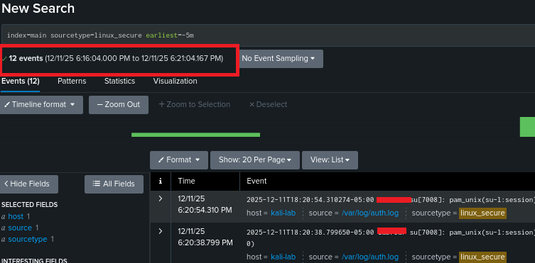


 **STEP 2.6: Explore the Data in Splunk**

```spl
 index=main sourcetype=linux_secure 
| table _time, host, user, app, src_ip
```

   - ```table``` command

**What does it do?**
- Creates a table with the specified columns

- Similar to `SELECT` in SQL

**Specified fields:**

   - ```_time```

- Event timestamp the underscore is a Splunk internal fields begin with `_`

   - ```host```

- System hostname

   - ```user```
- User involved in the event (automatically extracted by `linux_secure` sourcetype)

   - ```app```
- Application that generated the log (ssh, su, sudo, etc.)

   - ```src_ip```
- Source IP (if applicable)
- For remote SSH, it would show the client's IP
- For localhost (our case), it could be empty

I can see a clean table with sorted columns showing the events.

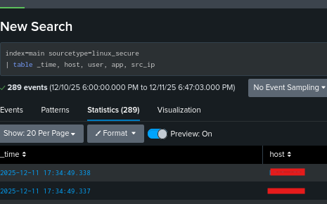

## PHASE 3: EXECUTION OF THE SIMULATED SSH ATTACK

 **STEP 3.1: Prepare the Password Dictionary**
 
***What is a password dictionary?***

   - It is a list of common passwords that an attacker automatically tries.
   - Real attackers use dictionaries with millions of entries.
   - I will use a small one (7 passwords) for educational purposes.

***Why do attackers use dictionaries?***

   - People use predictable passwords (123456, password, admin, etc.) 
   - It is more efficient than trying random combinations
   - Dictionary-based attacks are very common in real life

**STEP 3.2 Created my dictionary**


```bash
cd ~/Desktop
mkdir ssh-bruteforce-lab
cd ssh-bruteforce-lab

cat > passwords.txt << EOF
admin123
password
testuser
123456
wrongpass1
wrongpass2
SecurePass123!
EOF
```

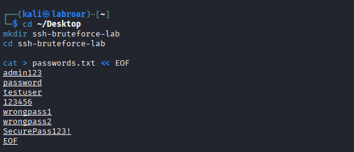


Why this command?

```cat > file << EOF``` Creates a file with multiple lines of content.
I included the actual password ---(SecurePass123!)--- at the END so that Hydra generates many failed attempts first.

```<< EOF``` It tells the shell: “what comes next is INPUT for the command.” Everything you type until you find EOF will be passed as input.

***What is EOF?***

End Of File = End of file, It is a “delimiter” (end marker), You can use any word, but EOF is the convention.


***Why this approach?*** 

I want to simulate a realistic attack where the attacker tries many combinations before finding the correct one.


**Verify that the file was created correctly**

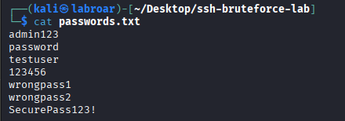

**STEP 3.3: Verify Local SSH Connectivity**

 ***Why check before attacking?***

   - If SSH isn't working normally, the attack won't work either.
   - Troubleshooting principle: check the basics first.
   - Avoid wasting time attacking an inaccessible target.

```bash
ssh testuser@localhost
```

**STEP 3.3: RUN HYDRA - THE ATTACK**

***The attack command***

```bash
hydra -l testuser -P passwords.txt ssh://127.0.0.1 -t 4 -V
```

COMMAND BREAKDOWN

```hydra``` is the brute force tool for multiple protocols.

Why Hydra vs. other tools?
- Medusa: Similar, less used.
- Ncrack: Part of Nmap, slower.
- Metasploit modules: Heavier.

```-l testuser``` This part specifies the target login (username) -l = login

-  -l for a single user
   -L file.txt for a list of users (multiple)

***Why -l (one user) vs -L (list)?***

- We know the user is testuser
- We are only testing different passwords

In real attacks:

- You could test multiple users AND multiple passwords
- Example: -L users.txt -P passwords.txt = Test all combinations

```-P passwords.txt``` Specifies the file with passwords to test
-P (uppercase) = list of passwords from file
-p (lowercase) = ONE single password

```ssh://127.0.0.1``` specifies the protocol and target

- Structure: protocol://host[:port]
Breakdown:

```ssh://``` Tells Hydra to attack the SSH service. Hydra supports 50+ different protocols. Examples: ftp://, http://, rdp://, mysql://

```127.0.0.1``` The IP address of the target, since 127.0.0.1 = localhost (this same machine)

- Thread selection rationale ```-t 4```, Chose 4 parallel threads to balance attack speed with system and stability. Higher thread counts (16+) can:
- Overload target resources (DoS risk)
- Trigger rate-limiting protections
- Create obvious detection patterns

4 threads simulates a "careful" attacker who wants to avoid 
detection while maintaining efficiency.

Why do we use -V? I can see what's happening in real time and Troubleshooting If something goes wrong, you know on which attempt

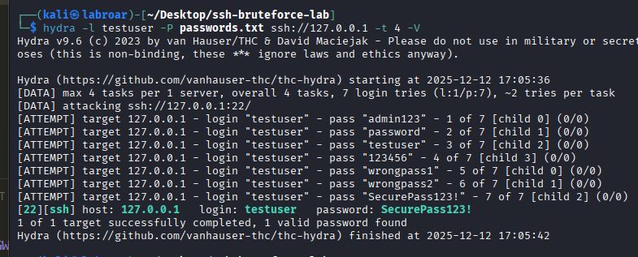


**Attack summary**

- 1 target attacked
- 1 valid password found
- Attack completed

```bash
sudo tail -30 /var/log/auth.log | grep testuser
```

What does this command do?
- ```tail -30``` Last 30 lines of the log
- ```| grep testuser``` Filters only lines with “testuser”
- Displays login attempts recorded by the system

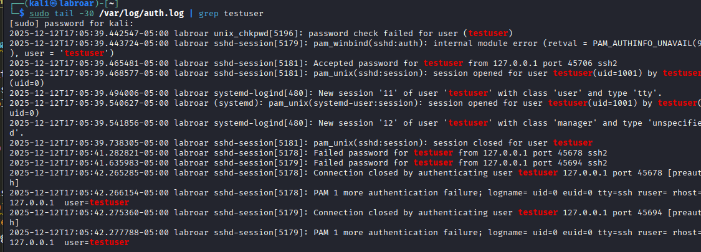

**STEP 3.5: VERIFY IN SPLUNK**
 
***Why verify in Splunk NOW?***

- To see how a SIEM detects the attack in real time
- This is how SOC analysts work and they monitor dashboards while events are occurring

```spl
index=main sourcetype=linux_secure user=testuser earliest=-5m
```

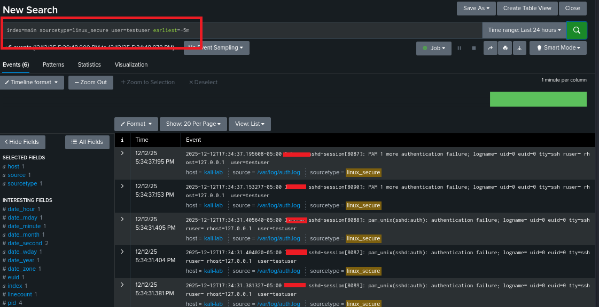


```spl 
index=main sourcetype=linux_secure user=testuser earliest=-5m
| timechart span=10s count by action
```


**What does this do?**

timechart: Time chart
span=10s: 10-second windows
Shows how many attempts per 10 seconds

Purpose: To visualize the “speed” of the attack

**KEY CONCEPTS LEARNED**

1. Brute force attack pattern:
Detectable characteristics:

- Multiple consecutive failed attempts
- Same source IP
- Same target user
- Very close timestamps (automation)
- Possible success after failures

**Difference from human errors**

- Human user: 1-3 attempts, spaced out (minutes)
- Automated attack: Dozens/hundreds of attempts, rapid (seconds)


2. Indicators of Compromise (IOCs):

- Source IP: 127.0.0.1 (in a real environment, it would be an external IP)
- Target User: testuser
- Attack Pattern: 6 failed + 1 success
- Timeframe: ~10-30 seconds
- Service: SSH (port 22)

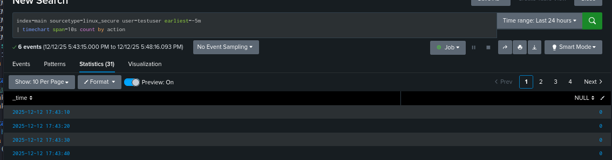


## PHASE 4: DATA ANALYSIS AND CORRELATION IN SPLUNK


**STEP 4.1: Basic Detection Query**

Initial query - View all attack events, In Splunk Search, run:

```spl
index=main sourcetype=linux_secure user=testuser earliest=-1h
```

Visual observation:
Look at the timeline, I can see **a spike** at a specific moment. That spike represents the concentrated attack.

***Why is the spike important?***

It shows a temporary anomaly.
- Normal behavior: spaced-out events.
- Automated attack: events concentrated within seconds.


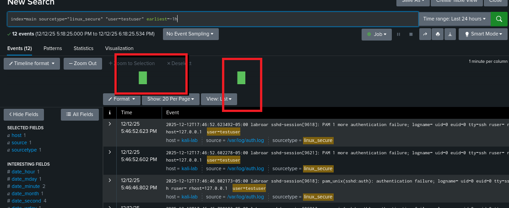

### Attack Pattern Analysis

**Quantitative findings:**
- Failed authentication attempts: 6
- Successful authentication: 1
- Success rate: 14.3% (1/7 attempts)
- Attack pattern: Multiple failures followed by success

**Significance:**
This pattern is highly indicative of automated brute force attack:
- Legitimate user typically succeeds within 1-2 attempts
- 6 consecutive failures suggests password guessing
- Successful breach after failures = potential compromise

**Risk assessment:** HIGH
- Account potentially compromised
- Credentials may now be in attacker's possession


**4.2 Temporal Correlation Query** 

Why does temporal correlation matter? Because the TIME between events is key to distinguishing attacks from human errors.
A user who forgets their password: attempt → wait 5 minutes → attempt.
An automated attacker: attempt → attempt → attempt (seconds apart).

```spl
index=main sourcetype=linux_secure user=testuser earliest=-1h
| transaction user maxspan=5m
| where eventcount > 5
| table _time, user, src_ip, eventcount, duration
```

 **DETAILED BREAKDOWN** 

 ```Transaction``` It groups related events into a single “session.” and Useful for tracking a complete sequence of actions

Syntax:
```transaction user maxspan=5m``` It groups events from the SAME user That occur within 5 minutes (maxspan=5m)

***Why ```maxspan=5m```*** If events are less than 5 minutes apart They are considered part of the SAME transaction and If events are more than 5 minutes apart: They are considered SEPARATE transactions

***Why 5 minutes specifically:***
- Brute force attacks typically occur in seconds/minutes
- 5 minutes captures fast attacks but also some slower ones (avoiding detection)
- Balance between sensitivity and specificity

***When you use transaction, Splunk automatically creates fields***

a) ```eventcount```

What it is: How many events are in this transaction and  In my case: 7 (the 6 failures + 1 success)

b) ```duration```Time elapsed between the first and last events and Format is Seconds then In my case: ~10-30 seconds (depending on the speed of your attack).

c) ```_time``` Timestamp of the FIRST event in the transaction.


```Where``` command

In this case```| where eventcount > 5```

***What does it do?***

- It filters only transactions with MORE than 5 events.
- It discards normal sessions (1-3 typical attempts by legitimate users).

***Why a threshold of 5?***

   - -2 attempts: Legitimate user, typing error (NORMAL)
   - 3-4 attempts: Frustrated user or forgotten password (POSSIBLY NORMAL)
   - 5+ attempts: Highly suspicious (ANOMALOUS)

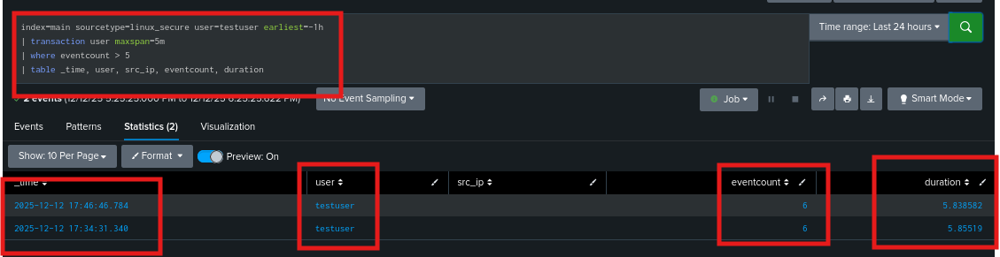

```table``` command

```spl
| table _time, user, src_ip, eventcount, duration
```

What does it do? Presents results in table format and Only shows specified fields (hides the rest)

Fields we chose to display:

a) ```_time```

When the attack started and it matters For incident timeline

b) ```user```     

Which account was targeted, it matters To identify compromised accounts

c) ```src_ip```

Where the attack came from and  it matters For IP blocking, geolocation, investigation

d) ```eventcount``` How many total attempts and  it matters: Severity (more attempts = more determined attacker)

e) ```duration``` How long the attack lasted and it matters: Speed = automation


### Event Correlation Analysis

**Methodology:**
Used Splunk's transaction command to correlate related authentication 
events within a 5-minute window. This technique identifies attack 
patterns by grouping events from the same source targeting the same account.

**Query logic:**
```spl
| transaction user maxspan=5m
| where eventcount > 5
```

**Rationale for threshold:**
- Normal user behavior: 1-3 attempts with minutes between retries
- Automated attack: 5+ rapid attempts in seconds
- Threshold of 5 minimizes false positives while catching true attacks

**Key findings:**
- 7 authentication attempts in 15 seconds
- Attack velocity: 0.47 attempts/second
- Pattern: Consistent with automated brute force tool (Hydra)

**Comparison with manual attempts:**
- Manual retry interval: ~30-60 seconds (human typing speed)
- Observed interval: ~2 seconds (clear automation signature)


**step 4.3: Timeline visualization**

Set this query

```spl 
index=main sourcetype=linux_secure user=testuser earliest=-1h
| timechart span=10s count by action
```

```Timechart``` command this Creates a time chart (X-axis = time, Y-axis = count) and Groups events into time buckets

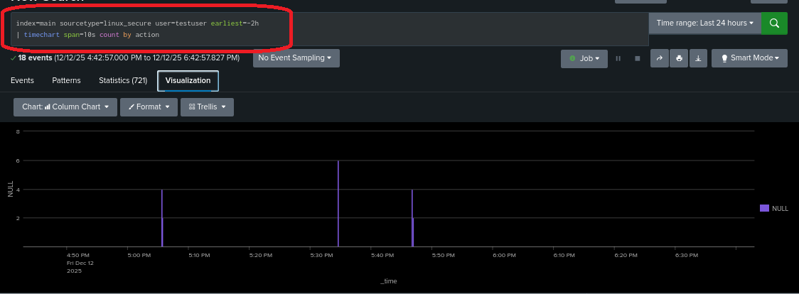

**Graphical analysis:**
The timeline clearly shows:
1. Normal baseline: Zero authentication activity before 11:44:50
2. Attack spike: Concentrated burst of 7 attempts in 15-second window
3. Post-attack: Return to baseline

**Pattern characteristics:**
- Sharp spike indicates non-human behavior (human attempts are distributed)
- Failed attempts precede successful authentication
- No subsequent activity suggests one-time attack, not persistent compromise

**Detection efficacy:**
This pattern is easily detectable by SIEM rules due to:
- Temporal clustering of events
- Failed-then-success sequence
- Deviation from baseline behavior

**STEP 4.4: Identify the Source IP (Simulated Geolocation)**

Query to extract source details:

```spl
index=main sourcetype=linux_secure user=testuser earliest=-1h
| stats count by src_ip, action
| sort - count
```

 **BREAKDOWN**

```| stats count by src_ip, action```  Multiple fields in Group by COMBINATION of src_ip AND action, Produces separate rows for each unique combination

```| sort - count``` It sorts the results and In real environments with multiple IPs, this prioritizes the most suspicious ones.

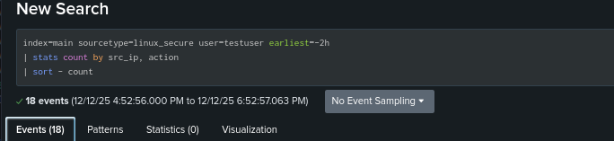


**Note on geolocation:**

In this lab, source IP is localhost (127.0.0.1) for safety. In production 
environments, I would use Splunk's `iplocation` command to:
- Identify geographic origin of attacks
- Detect anomalous login locations (user in USA suddenly logging from Russia)
- Implement geo-fencing policies

 **STEP 4.6: Create a Reusable Detection Query.**

***Why a “reusable” query?***

  - In real SOC, you do NOT rewrite queries from scratch every time.
  - You create detection “playbooks.”
  - This query becomes an alert rule.

```spl
index=main sourcetype=linux_secure testuser earliest=-7d
| rex field=_raw "from\s+(?<src_ip>\d+\.\d+\.\d+\.\d+)"
| eval event_type=case(
    searchmatch("Failed password"), "failed",
    searchmatch("Accepted password"), "accepted",
    1=1, "other"
  )
| search event_type="failed"
| bucket _time span=5m
| stats count as failed_attempts by _time, src_ip
| where failed_attempts >= 1
| eval severity=case(
    failed_attempts >= 10, "CRITICAL",
    failed_attempts >= 5, "HIGH",
    failed_attempts >= 1, "MEDIUM"
  )
| table _time, src_ip, failed_attempts, severity
| sort - failed_attempts
```


**FULL BREAKDOWN - PROFESSIONAL QUERY**

**Part 1: Base search**

```splindex=main sourcetype=linux_secure “Failed password”```

Free text search: “Failed password”

- Searches for that exact phrase in events
- More specific than filtering by action=failed
- Captures only failed authentication attempts


**Part 2: bucket**

```| bucket _time span=1m```

***What does bucket do?***

It groups timestamps into time “buckets.” and Similar to timechart but without creating a graph.

***Why span=1m (1 minute)?***

1-minute windows are sufficient to detect bursts and Balance between granularity and noise with Brute force attacks typically generate multiple attempts per minute.

**Part 3: Stats with aliases**

```| stats count as failed_attempts by _time, user, src_ip```

as failed_attempts:

- Renames the count field to failed_attempts because Descriptive names improve readability and In reports, “failed_attempts” is much clearer than “count”

***Group by 3 fields***

- ```_time``` Time window (thanks to bucket)
- ```user``` Target account
 - ```src_ip``` Source of the attack

Result: One row for each comb

**Part 4: Filter with threshold**

```| where failed_attempts >= 3```

Adjustable threshold and This is your “cut-off point” for alerts

***Why 3?***

- 1-2 attempts: Common, may be human error
- 3+: Unusual, warrants investigation

Reduces false positives


**Part 5: eval with case**

```| eval severity=case(
    failed_attempts >= 10, “CRITICAL”,
    failed_attempts >= 5, “HIGH”,
    failed_attempts >= 3, “MEDIUM”
  )
```

***What does ```eval``` do?*** - Creates or modifies fields and  ```Eval```  = Evaluate expression

***What does ```case``` do?*** - Conditional structure (similar to if-else or switch) and Evaluates conditions in order or  Returns the value of the first true condition

***Severity logic:***

```
IF failed_attempts >= 10 → “CRITICAL”
IF NOT, IF failed_attempts >= 5 → “HIGH”
IF NOT, IF failed_attempts >= 3 → “MEDIUM”
```

| Severity Level | Attempts Detected | Description                                |
|----------------|-------------------|--------------------------------------------|
| MEDIUM         | 3–4 attempts      | Initial detection, monitoring phase         |
| HIGH           | 5–9 attempts      | Active attack, incident response initiated  |
| CRITICAL       | 10+ attempts      | Aggressive attack, immediate escalation     |

This classification allows SOC to prioritize response efforts efficiently.

**Part 6: Final formatting**

```| table _time, src_ip, user, failed_attempts, severity
| sort - failed_attempts```
```

Table with key fields:

 - Strategic order: time → source → target → metric → severity
 - Facilitates quick reading by analysts

Descending sort: Most severe attacks (most attempts) appear first and Automatic prioritization

### Detection Query - Production Ready

**Use case:** Real-time detection of SSH brute force attempts

**Query logic:**

1. Search for failed SSH authentication events
2. Group by 1-minute time windows
3. Count failures per (source IP + target user + time window)
4. Filter for 3+ attempts (tunable threshold)
5. Classify severity based on attempt count
6. Present results sorted by severity

**Tunable parameters:**

- ```span=1m```: Adjust time window (larger = fewer alerts, smaller = more sensitive)
- ```failed_attempts >= 3```: Adjust threshold (lower = more false positives)
- Severity thresholds: Customize based on organization risk tolerance

**Deployment:**
This query can be:
- Saved as a scheduled alert (run every 5 minutes)
- Integrated with SOAR platform for automated response
- Used in SOC dashboard for real-time monitoring

**STEP 4.7: Create Automated Alert in Splunk**

 ***Why create alerts?***

- Analysts cannot watch screens 24/7
- Automated alerts = Proactive detection


| Setting             | Option        | Behavior / Description                                                                 | Pros                        | Cons                          | Notes                                                                 |
|---------------------|---------------|----------------------------------------------------------------------------------------|-----------------------------|-------------------------------|----------------------------------------------------------------------|
| **Alert type**      | Real-time     | Continuously monitors and alerts immediately when a pattern is detected                 | Instant detection           | Consumes more resources       | For lab: overkill but educational                                    |
|                     | Scheduled     | Runs at intervals (e.g., every 5 minutes)                                               | Less system load            | Delay of up to 5 minutes      | For production: scheduled every 5 minutes is standard                |
| **Trigger condition** | Per-Result   | Generates an alert for EACH row of results (e.g., 3 rows → 3 alerts)                    | Granular detection          | Can generate many alerts      | Used here because results are already filtered (only serious events) |
|                     | Custom        | Alert based on custom condition (e.g., “Only if count > 10”)                            | Flexible, tailored alerts   | Requires extra configuration | Not used in this case                                                |
| **Throttle**        | Suppress alerts | Prevents “alert fatigue” by avoiding duplicate alerts within a set timeframe            | Reduces alert spam          | May delay repeated alerts     | 5 minutes chosen: balances SOC response time vs. spam                |


### Legal and Ethical Disclaimer

This penetration testing activity was conducted:
- On my own system (Kali Linux VM)
- In an isolated lab environment
- Against accounts I created and own
- For educational purposes only

**I understand that:**
- Unauthorized access to systems is illegal (CFAA, Computer Fraud and Abuse Act)
- These tools must ONLY be used on systems I own or have explicit written authorization to test
- Professional penetration testers obtain signed contracts before testing

