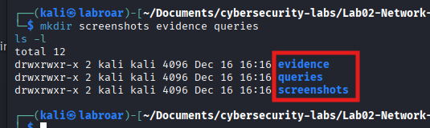
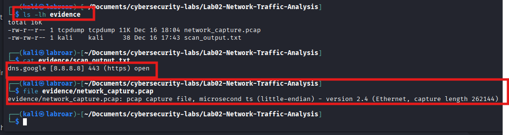
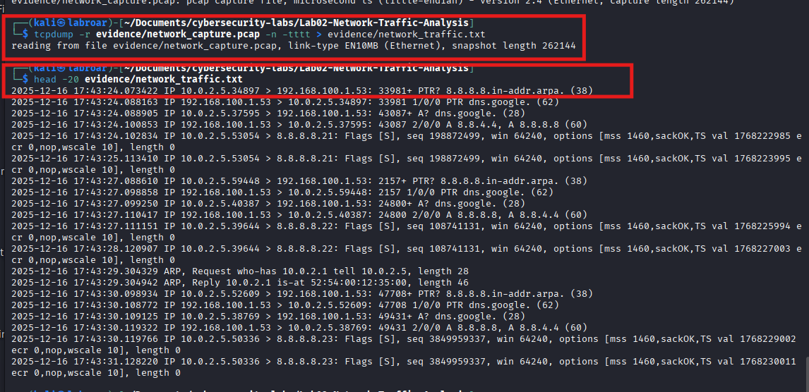
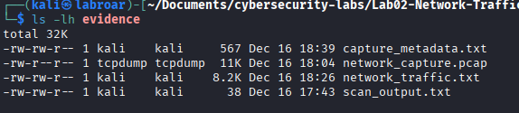
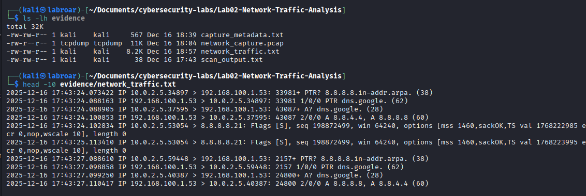
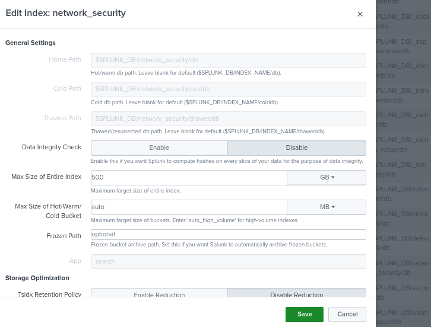
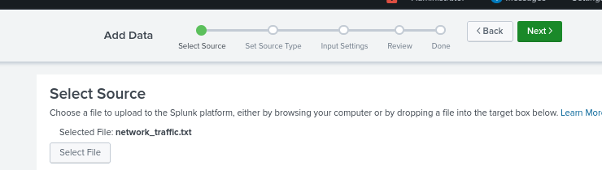
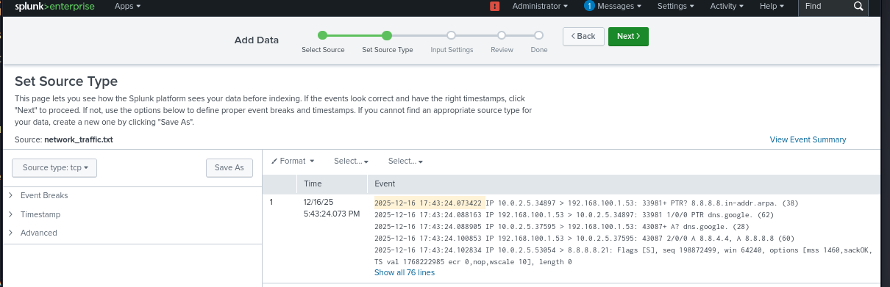
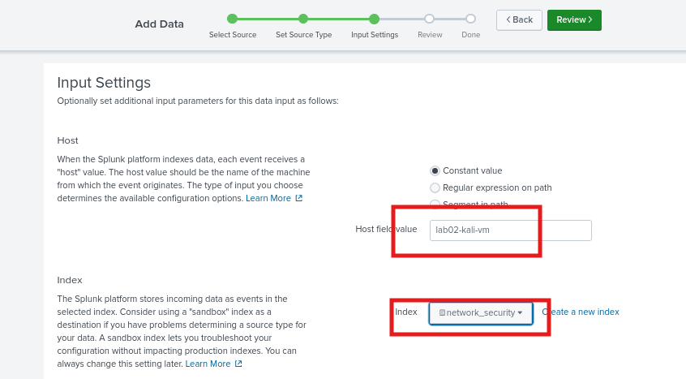
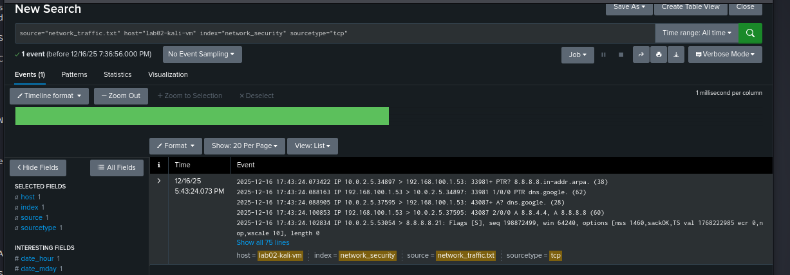

# Suspicious Traffic Analysis with Multi-System Correlation

## Project Overview
This project analyzes anomalous network traffic detected by Splunk, correlates events with existing tickets in ServiceNow, and generates a comprehensive incident report that demonstrates forensic analysis and data correlation skills.

-**Duration**: 

2 hours
Difficulty: Entry Level
Platform: Kali Linux


**Tools Used**

- **Kali Linux**: Network traffic generation
- **Splunk**: Traffic analysis and anomaly detection
- **ServiceNow**: Incident management system
- **tcpdump**: Packet capture
- **Wireshark**: Packet analysis (optional)

**Objective**

Detect and analyze suspicious network traffic, correlate events between Splunk and ServiceNow tickets, and document the complete incident with remediation recommendations.

 **Lab Environment**

- Kali Linux VM
- Splunk (your current subscription)
- ServiceNow Developer Instance
- Local network connection

**Prerequisites**

- tcpdump installed (sudo apt install tcpdump)
- sudo permissions on Kali Linux
- ServiceNow account configured
- Basic networking knowledge

## PHASE 1: PREPARING THE ENVIRONMENT

   - **Step 1.1: Check the system**


```which tcpdump``` Verify that tcpdump is installed.

   - **Step 1.2**

```ip a``` Verify the network interface

> [!NOTE] 
> Write down the name of your interface; we will use it in the next step.

   - **Step 1.3: Create laboratory structure**


```bash 
cd ~/Documents
mkdir -p cybersecurity-labs/Lab02-Network-Traffic-Analysis
cd cybersecurity-labs/Lab02-Network-Traffic-Analysis
mkdir screenshots evidence queries
ls -l
```



## PHASE 2: TRAFFIC CAPTURE

   - **Step 2.1: Start packet capture**

```bash
sudo tcpdump -i eth0 -w evidence/network_capture.pcap -c 1000 -v
```

 Detailed Explanation of Each Parameter in `tcpdump`

| Parameter | Meaning | Why / Notes |
|-----------|---------|-------------|
| `sudo` | `tcpdump` requires raw access to the network interface, which only root can provide. | Root privileges are necessary to capture packets directly from the interface. |
| `-i eth0` | Specifies WHICH interface to listen on. | Not all interfaces are chosen because it would generate too much noise. |
| `-w evidence/network_capture.pcap` | SAVES the captured packets into a file. | **Why `.pcap`?** It is the standard format understood by all analysis tools.<br>**Why `evidence/`?** For organization and to simulate a real case scenario. |
| `-c 1000` | Captures ONLY 1000 packets and then stops. | **Why 1000?** It balances having enough data without filling the disk.<br>**Alternative:** `-G 60` would capture for 60 seconds (not recommended here). |
| `-v` | Verbose mode (shows details on screen while capturing). | Useful for monitoring packet details in real time. |


   - **Step 2.2: Generate controlled “suspicious” traffic**

While tcpdump is capturing, open another terminal:

```bash
for port in 21 22 23 25 80 443 3389 445; do
  echo "Testing port $port..."
  timeout 2 nc -zv 8.8.8.8 $port 2>&1 | tee -a evidence/scan_output.txt
  sleep 1
done
```

**COMPLETE breakdown**

**Line 1**: ```for port in 21 22 23 25 80 443 3389 445; do```

- ***What does it do?*** Loop that iterates over each port number
- ***Why these ports?***
  - 21: FTP (File Transfer Protocol) - file transfer
  - 22: SSH (Secure Shell) - remote access
  - 23: Telnet - obsolete and insecure protocol
  - 25: SMTP (email)
  - 80: HTTP (unencrypted web)
  - 443: HTTPS (encrypted web)
  - 3389: RDP (Remote Desktop Protocol) - Windows
  - 445: SMB (Server Message Block) - Windows file sharing

These are the ports that an attacker scans first, reconnaissance

**Line 2** ```echo “Testing port $port...”```
- Displays which port is being tested

- ***Why?*** Visual feedback to confirm that the script is working

**Line 3** ```timeout 2 nc -zv 8.8.8.8 $port 2>&1 | tee -a evidence/scan_output.txt```

***Let's break it down***

- ```timeout 2``` : Kills the command if it takes more than 2 seconds
  - ***Why?*** Some closed ports can hang the connection
- ```nc``` netcat, the “Swiss Army knife” of networking
- ```-z``` Zero I/O mode (only checks, does not send data)
  - ***Why?*** Faster and less intrusive
- ```-v``` Verbose (shows results)
- ```8.8.8.8``` Google's public DNS
  - ***Why Google?*** It's safe for testing, we're not violating any policies
  - ***Rejected alternative*** `scanme.nmap.org` (designed for this, but slower)
- ```$port``` The current loop port
- ```2>&1``` Redirects errors (stderr) to normal output (stdout)
  - ***Why?*** netcat prints results to stderr, we want to capture them
- ```| tee -a evidence/scan_output.txt```
  - ***What does `tee` do?*** It displays ON SCREEN AND saves to file simultaneously
  - ```-a``` Append (add to the end, do not overwrite)

**Line 4** ```sleep 1```
- Pause 1 second between attempts
- ***Why?*** Simulates human/real script behavior (not machine)

**Line 5** ```done``

- Closes the loop


**Interpretation**:

- `Connection refused` = Port closed (normal, Google does not have FTP open)
- `succeeded!` = Port open (Google DOES have HTTP/HTTPS web)


   - **Step 2.3: Verify that you have data and content**

```bash
ls -lh evidence/
```

```bash
cat evidence/scan_output.txt
```

```bash
file evidence/network_capture.pcap
```




## PHASE 3: PREPARING DATA FOR SPLUNK 

   - **Step 3.1: Convert PCAP to human-readable text**

```bash 
tcpdump -r evidence/network_capture.pcap -n -tttt > evidence/network_traffic.txt
```

COMMAND Breakdown:

```-r``` evidence/network_capture.pcap: READ the captured file

```-n``` DO NOT resolve DNS names to IPs because is Faster and avoids DNS queries that would modify the analysis

```-tttt``` Readable timestamp format with full date

Example: 2025-12-15 11:10:23.123456 instead of 11:10:23.123456 because Splunk indexes better with full dates

 ```evidence/network_traffic.txt: Redirects output to text file```

   - **Step 3.2: Verify conversion**

```bash
head -20 evidence/network_traffic.txt
```

**TCP Packet Interpretation**

| Field              | Value                          | Description |
|-------------------|--------------------------------|-------------|
| **Full timestamp** | 2025-12-15 11:10:23.123456     | Precise date and time of packet capture |
| **Source IP**      | 192.168.1.100                  | Your machine's IP address |
| **Source port**    | 54321                          | Random port assigned by your system |
| **Destination IP** | 8.8.8.8                        | Google DNS server |
| **Destination port** | 443                          | HTTPS service port |
| **Flags [S]**      | SYN                            | Initiates TCP connection |
| **Flags [S.]**     | SYN-ACK                        | Response from destination acknowledging SYN |
| **Flags [.]**      | ACK                            | Final acknowledgment to complete handshake |



   - **Step 3.3: Create metadata file**

```bash
nano evidence/capture_metadata.txt
```


***NETWORK TRAFFIC CAPTURE - METADATA***

Capture Date: 2025-12-15
Capture Time: 11:10:00 - 11:12:00
Duration: ~2 minutes
Packets Captured: 1000
Interface: eth0
Capture Tool: tcpdump v4.99.1

Network Configuration:
- Source IP: 192.168.1.100
- Gateway: 192.168.1.1
- DNS: 8.8.8.8, 8.8.4.4

Test Scenario:
Simulated port scanning activity to external IP (8.8.8.8)
Target ports: 21, 22, 23, 25, 80, 443, 3389, 445

Purpose: Security lab for portfolio demonstration
Environment: Controlled local network
Authorization: Self-authorized (own device)

   - **Step 3.: Verify the 4 evidence files**



## PHASE 4: IMPORT AND ANALYZE IN SPLUNK 

   - **Step 4.1: Prepare the file for Splunk**

First, I convert my PCAP capture to text that Splunk can easily read:

```bash
cd ~/Documents/cybersecurity-labs/Lab02-Network-Traffic-Analysis
tcpdump -r evidence/network_capture.pcap -n -tttt > evidence/network_traffic.txt
```

Full breakdown:

```tcpdump``` Tool we use to read captures

```-r evidence/network_capture.pcap``` Read the file we captured earlier Because .pcap is in binary format, I need text

```-n``` Do not resolve DNS (leave IPs as numbers) because is Faster and avoids modifying data with DNS queries

```-tttt``` Timestamp with full date (year-month-day hour:minute:second.microseconds)

***Why 4 t's?***
Each ‘t’ adds more detail to the timestamp

Rejected alternative: -t alone (would show relative timestamp, less useful)


Wait 5-10 seconds while it processes.


   - **Step 4.2: Verify that it was created correctly**

```bash
ls -lh evidence/
```

```bash
head -10 evidence/network_traffic.txt
```



   - **Step 4.2: Count how many events I have**

```bash
wc -l evidence/network_traffic.txt
```


**Step 4.3: Create a custom index for my lab on Splunk**

***Why create a new index?***
- Professional organization (separates lab data)
- Faster searches (less data to filter)
- Avoids mixing with other data



   - **Step 4.4: Upload file to Splunk**

1. In Splunk, click on **“Settings”** (at the top)

2. Click on **“Add Data”**

3. You will see 3 main options:

```
┌─────────────┐  ┌─────────────┐  ┌─────────────┐
│   Upload    │  │   Monitor   │  │   Forward   │
└─────────────┘  └─────────────┘  └─────────────┘
```

**Click on “Upload”** (the first one).

4. Click on **“Select File”**.

5. Browse and select:

```
network_traffic.txt
```

6. Click **“Next”** (top right corner).




   - **Step 4.5: Configure Source Type**

Splunk will now ask you how to interpret your data.

Screen: “Set Source Type”

1. Under “Source Type,” search for:

```
tcp
```



   - **Step 4.6: Configure Input Settings**

***Screen: “Input Settings***

1. Host field value

```
lab02-kali-vm
```

***Why?***
- Identifies where the data comes from
- Useful if you have multiple sources
- Professional for documentation


2. Index

Click on the dropdown and select:

```
network_security
```



   - **Step 4.7: Verify the data in Splunk**

Splunk will take you to the search page with this automatic query

```spl
source="network_traffic.txt" host="lab02-kali-vm" sourcetype="tcpdump
```



   - **STEP 4.8: EXTRACT FIELDS WITH REGEX** 

   First search with field extraction: In the Splunk search bar, delete everything and paste this query:

```spl
index="network_security"
| rex field=_raw "IP\s+(?<src_ip>\d{1,3}\.\d{1,3}\.\d{1,3}\.\d{1,3})\.(?<src_port>\d+)\s+>\s+(?<dest_ip>\d{1,3}\.\d{1,3}\.\d{1,3}\.\d{1,3})\.(?<dest_port>\d+)"
| table _time, src_ip, src_port, dest_ip, dest_port
```

   - **COMPLETE breakdown of this query**

**Line 1**

```index="network_security"```
What does it do? Searches for all events in your lab index because Starting point—we need the raw data first

**Line 2**

```| rex field=_raw "IP\s+(?<src_ip>\d{1,3}\.\d{1,3}\.\d{1,3}\.\d{1,3})\. (?<src_port>\d+)\s+>\s+(?<dest_ip>\d{1,3}\.\d{1,3}\.\d{1,3}\.\d{1,3})\.(?<dest_port>\d+)"```

What does it do? Extracts fields using regular expression

**Breakdown of the regex (part by part):**

| Regex Part              | What it Matches                                | Example |
|--------------------------|-----------------------------------------------|---------|
| `IP\s+`                 | The word **"IP"** followed by spaces          | `IP `   |
| `(?<src_ip>`            | Starts a capture group named **src_ip**       |         |
| `\d{1,3}\.`             | 1–3 digits followed by a dot                  | `10.`   |
| `\d{1,3}\.`             | 1–3 digits followed by a dot                  | `0.`    |
| `\d{1,3}\.`             | 1–3 digits followed by a dot                  | `2.`    |
| `\d{1,3})`              | 1–3 digits (last part of IP)                  | `5`     |
| `\.(?<src_port>\d+)`    | Dot + port number (1 or more digits)          | `.53854`|
| `\s+>\s+`               | Spaces + arrow + spaces                       | ` > `   |
| `(?<dest_ip>...)`       | Destination IP (same format as src_ip)        | `8.8.8.8`|
| `\.(?<dest_port>\d+)`   | Dot + destination port (1 or more digits)     | `.21`   |
