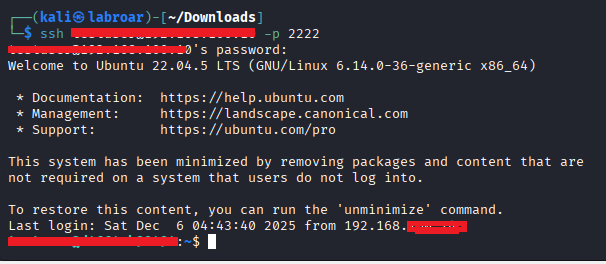
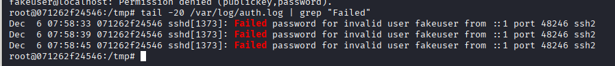
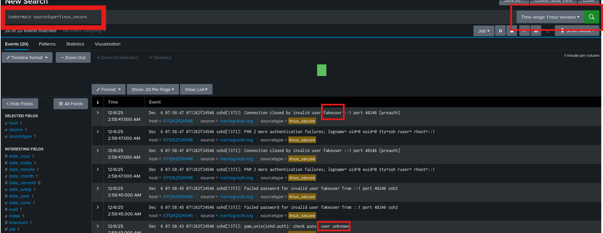

# SIEM Dashboard - Detección SSH Brute Force

## Project Overview

This cybersecurity project simulates brute-force attacks targeting SSH services and leverages Splunk to detect and visualize malicious activity in real time. Using Kali Linux as the attacker and Ubuntu as the victim environment, I employed Hydra to generate failed login attempts and configured Splunk Universal Forwarder and Splunk Enterprise to collect and analyze log data.

-**Duration**: 4 hours
Difficulty: Entry Level
Platform: Kali Linux, Ubuntu

-**Tools:**

   -  Hydra

   - Splunk Universal Forwarder

   - Splunk Enterprise

-**Objective**

1. Create a dashboard that detects and visualizes brute force attempts against SSH services in real time

-**Lab Enviroment**

Kali Linux 2025.2-virtualbox-amd64

Docker

Network Interface: eth0 / wlan0

-**Prerequistes**

Basic Python or Bash scripting

SSH Protocol Fundamentals

Splunk Components

Hydra Tool Basics

## SIEM Dashboard - Detección SSH Brute Force - Detailed Report

Analyst: Raiza Rosas Aguilar
Date: 30-11-25
Duration: 20 minutes
Total Logs: [110]

## Executive Summary

This project simulates SSH brute force attacks and configures Splunk to detect them automatically. I implement alerts based on thresholds for failed attempts and create visualizations that allow a SOC team to identify attack patterns. The result is a functional dashboard that displays attacking IPs, frequency of attempts, and attack timelines.

-**Methodology**

Machine used: Kali Linux (attacker) + Docker ubuntu(simulated victim)

***conected SSH**

```bash
ssh ...@192.168.100.x
```

***configure my splunk**

```bash
ip addr show | grep "inet " | grep -v 127.0.0.1 
```


**checked status my splunk**

```bash
sudo /opt/splunk/bin/splunk start
```


*this found the http://---:8000*

**checked if splunk listening**

```bash
sudo netstat -tlnp | grep 9997
```
**created docker**

```docker --version```
Docker version 27.5.1+dfsg4, build .....


*hostname@localhost*

**Step 1** 

In the victim environment, I place this script.

```bash
sudo apt update
sudo apt install openssh-server -y
sudo systemctl start ssh
sudo systemctl enable ssh
```

I checked SSH is running

```bash
sudo systemctl status ssh
```


I verified SSH it's right

 ```bash
sudo systemctl status ssh
```

## poner ss aqui

***Why these commands?***

I need an active SSH service to attack in a controlled manner

```systemctl enable``` ensures that SSH starts automatically

**Step 2: Installing Splunk Universal Forwarder on the Victim**

Download forwarder 

```bash
wget -O splunkforwarder.tgz 'https://download.splunk.com/products/universalforwarder/releases/9.1.0/linux/splunkforwarder-9.1.0-linux-2.6-amd64.deb'
```

Installed

```bash
sudo dpkg -i splunkforwarder-9.1.0-linux-2.6-amd64.deb
```

Configured to monitor authentication logs

```bash
sudo /opt/splunkforwarder/bin/splunk start --accept-license
sudo /opt/splunkforwarder/bin/splunk add forward-server [IP_DE_TU_SPLUNK]:9997
sudo /opt/splunkforwarder/bin/splunk add monitor /var/log/auth.log -index main
```


## poner sss aqui

***Why this path?***

SSH logs are stored in ```/var/log/auth.log.```

Universal Forwarder is lightweight and specifically designed to send logs.

**Port 9997** is the standard for receiving data in Splunk.

**Step 3: Attak Simulation** 

From Kali Linux

I created a field of common users

```bash
echo -e "root\nadmin\nuser\ntestuser" > users.txt
```

I created a file of common passwords.

```bash
echo -e "password\n123456\nadmin\nletmein" > passwords.txt
```

Set up Hydra

```bash
hydra -L users.txt -P passwords.txt ssh://[IP_VICTIMA] -t 4 -V
```

## poner SS aqui

***Create failed SSH attempts***

-Attempts to connect with a fake username (to generate error logs)

```bash
ssh fakeuser@localhost -p 2222
```

-It will ask you for a password. Enter any incorrect password three times to generate failed attempts.


-Then try with the correct user:
connection successful

```bash 
ssh victim@localhost -p 2222
```



What happened?

Failed attempts will be recorded in ```/var/log/auth.log```




Splunk Forwarder will send those logs to your Splunk server. ```192.168.100.x:9997```

I can view events in my Splunk instance.



***Why Hydra?***

It is the industry standard tool for brute force attacks.

```-t 4``` limits threads so as not to saturate (be “responsible” in the attack).
```-V``` shows verbose to document the process.

**Alternative rejected:** Medusa or Ncrack

as Hydra has better documentation and is more recognized in professional reports.

**Step 4: SPL queries in Splunk**

   - *Query 1: Detect failed attempts*

```spl
index=main sourcetype=linux_secure "Failed password"
| rex field=_raw "Failed password for (?<failed_user>\S+) from (?<src_ip>\S+)"
| stats count by src_ip, failed_user
| where count > 5
| sort -count
```

## poner ss 

   - *Query 2: Timeline of Attacks*

```spl
index=main sourcetype=linux_secure "Failed password"
| timechart count by src_ip
```

## poner ss qui

   - *Query 3: Most targeted users*

```spl
index=main sourcetype=linux_secure "Failed password"
| rex field=_raw "Failed password for (?<user>\S+)"
| top user limit=10
```  

## poner ss aqui

**Step 5: Creating the Dashboard**

I created 4 panels

1. Table of suspicious IPs (Query 1)
2. Timeline graph (Query 2)
3. Top users attacked (Query 3)
4. Heat map : ``| iplocation src_ip | geostats count``

## Comandos y Herramientas Usadas
|        **Tool**      |        **Use**       |              **Main key**                          |
|----------------------|----------------------|----------------------------------------------------|
|      Hydra           | Simulación de ataque |```hydra -L users.txt -P passwords.txt ssh://IP```  |
|Splunk Forwarder      | Recolección de logs  | ```splunk add monitor /var/log/auth.log```         |
|       SPL            | Análisis de datos    |  ```rex```, ```stats```, ```timechart```           |

***Why This Approach?***

   - SSH is universal: All Linux servers use it.
   - Visible in logs: Easy to detect without complex tools.
   - Real relevance: 80% of breaches start with weak credentials.

***Purpose of the Lab***

-Demonstrate the ability to:

1. Configure monitoring systems (SIEM).
2. Simulate controlled attacks (red team thinking).
3. Create actionable visualizations for SOC
4. Understand Linux logs at a granular level

## Conclusion

This lab demonstrates competence in detecting basic but critical threats. Recruiters are looking for candidates who understand the entire cycle: attack → detection → response. The dashboard you create is a tangible piece that you can show in interviews. Upload screenshots of the dashboard, SPL code, and Hydra logs to your GitHub with clear documentation.
 
