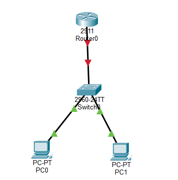
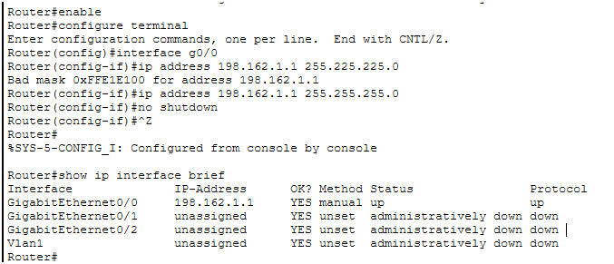
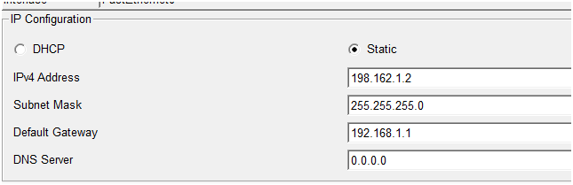
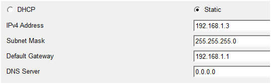
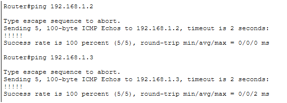
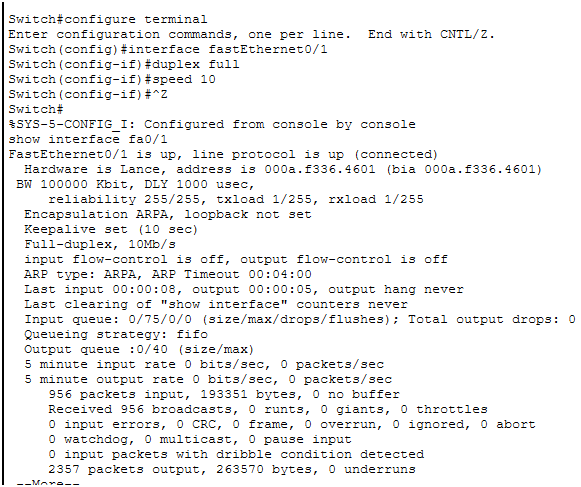

# Objetivo
Detectar y resolver problemas de interfaz en un router y switch simulados.

## Paso a paso

Montar la topología

1. Coloca un Router 2911, un Switch 2960, y dos PCs.

2. Conecta con cables Copper Straight-Through.


> Por qué: simula un entorno LAN básico donde suelen aparecer problemas de interfaz.

Configurar IPs en el router y PCs

1. Router (G0/0): 192.168.1.1 /24
Paso a paso

```bash
Router> enable
Router# configure terminal
Router(config)# interface g0/0
Router(config-if)# ip address 192.168.1.1 255.255.255.0
Router(config-if)# no shutdown
```



> Por qué: La IP 192.168.1.1 será el gateway de la red. y ***no shutdown*** activa la interfaz, porque por defecto está apagada.

Con ctrl+Z regresas a modo privilegiado y puedes usar el comando 

```bash
show ip interface brief
```
Para poder verificar si se configuro correctamente la interface que elegimos configurar


2. PC0: 192.168.1.2 /24 (gateway 192.168.1.1)

PC0
Haz clic en el PC → Desktop → IP Configuration.

Asigna:

IP: ***192.168.1.2***

Subnet Mask: ***255.255.255.0***

Default Gateway: ***192.168.1.1***



> Por qué:La máscara asegura que está en la misma red /24 y El gateway permite que el PC se comunique fuera de su segmento local.


3. PC2: 192.168.1.3 /24 (gateway 192.168.1.1)

Haz clic en el PC → Desktop → IP Configuration.

Asigna:

IP: ***192.168.1.3***

Subnet Mask: ***255.255.255.0***

Default Gateway: ***192.168.1.1***

Por qué: Igual que PC0, pero con una IP distinta para evitar conflictos y Todos los dispositivos comparten el mismo gateway



> Por qué: establecer direccionamiento básico para probar conectividad.

Prueba de conectividad

1. Verificar estado de interfaces en el router
Desde el router:

```bash
ping 192.168.1.2
ping 192.168.1.3
```

> Por qué: así verificas que el router puede alcanzar a los hosts y que el direccionamiento está bien configurado.



Simular un error de interfaz (dúplex/velocidad) y diagnosticarlo

1. Forzar un mismatch de dúplex

En el switch 

```bash
Switch> enable
Switch# configure terminal
Switch(config)# interface fastEthernet0/1
Switch(config-if)# duplex half
```

en el router

```bash
Router> enable
Router# configure terminal
Router(config)# interface g0/0
Router(config-if)# duplex full
```

> Por qué: al tener un extremo en half-duplex y otro en full-duplex, se generan colisiones y pérdida de paquetes.

Diagnóstico con show interfaces

- En el router:

```bash
show interfaces g0/0
```

Observa:

- Input errors

- Collisions

- Late collisions  

Estos indicadores confirman el problema de dúplex.

Solución

- Configura ambos extremos en el mismo dúplex y velocidad:

```bash
Router(config-if)# duplex full
Router(config-if)# speed 1000
```

```bash
Switch(config-if)# duplex full
Switch(config-if)# speed 1000
```

Por qué: al igualar parámetros, desaparecen las colisiones y la comunicación se estabiliza.




## **Conclusión final**

- Este ejercicio mostró que:

La conectividad no depende solo de la IP y la máscara, sino también de parámetros físicos como dúplex, velocidad y cableado.

Los comandos de verificación (***show ip interface brief***, ***show interfaces***) son esenciales para diagnosticar problemas.


