# Reconocimiento de las caracteristicas de la topologia de la red

## Hay 3 topologias de red básicas 

- RING, STAR, BUS

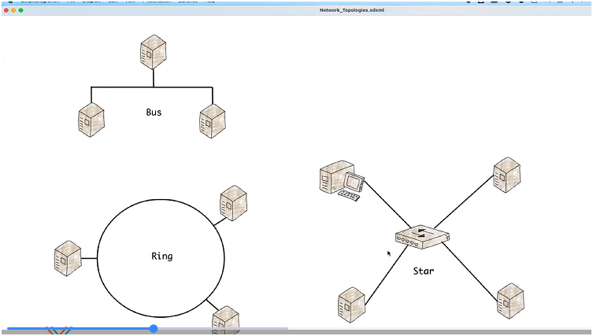

## Bus

- Se conectan todos los dispositvos entre si

- Hay una capacidad limitada antes de que el trafico se congestione o caiga   

Se utiliza en redes inalambricas, en los AP inalambricos 

## Ring

- El trafico de red actua hacia un solo sentido

-Su limitacion es que el costo es Alto

## Star 

- Puede conectarse a un dispositivo que necesite sin molestar a ninguno de los demas

- da mas ancho de banda

## Topología en malla

Diseño: Cada dispositivo se conecta con varios otros, creando múltiples rutas.

Ejemplo: Redes de telecomunicaciones y backbone de Internet.

Ventaja: Alta redundancia y confiabilidad.

Desventaja: Costosa y compleja de implementar.
- Permite la comunicacion de la manera que necesitamos para tener la velocidad maxima

## Topología híbrida

Diseño: Combinación de varias topologías (estrella + bus, estrella + malla).

Ejemplo: Redes empresariales modernas que mezclan switches, routers y enlaces redundantes.

Ventaja: Flexibilidad y escalabilidad.

Desventaja: Puede ser difícil de administrar.

1. **Physical Topology** es como los equipos de estan realmente conectados entre si  

2. **Logical Topology** es como funciona la red para enviar datos

# Tipos de Redes

1. **LAN (Local Area Network)**
- Qué es: Red local, limitada a un espacio físico pequeño (casa, oficina, escuela).

*Ejemplo: La red Wi-Fi de tu casa que conecta tu laptop, celular y Smart TV.

*Ventaja: Alta velocidad y bajo costo.

2. **WAN (Wide Area Network)**
- Qué es: Red que conecta varias LAN a gran escala, incluso países.

- Ejemplo: Internet es la WAN más grande.

- Ventaja: Permite comunicación global.

3. **MAN (Metropolitan Area Network)**

- Qué es: Red que cubre una ciudad o área metropolitana.

- Ejemplo: La red de fibra óptica que conecta universidades y oficinas en CDMX.

- Ventaja: Mayor alcance que una LAN, pero más controlada que una WAN.

4. **PAN (Personal Area Network)**
- Qué es: Red personal, de corto alcance.

- Ejemplo: Conexión Bluetooth entre tu celular y audífonos.

- Ventaja: Muy práctica para dispositivos portátiles.

5. **WLAN (Wireless LAN)**
- Qué es: Variante de LAN, pero inalámbrica.

- Ejemplo: Wi-Fi en cafeterías o aeropuertos.

- Ventaja: Movilidad sin cables.

6. **VPN (Virtual Private Network)**

- Qué es: Red virtual que crea un túnel seguro sobre Internet.

- Ejemplo: Usar una VPN para acceder a recursos de tu empresa desde casa.

- Ventaja: Seguridad y privacidad.

7. **SAN (Storage Area Network)**

- Qué es: Red especializada en almacenamiento de datos.

- Ejemplo: Servidores de una empresa que comparten grandes volúmenes de información.

- Ventaja: Alta velocidad para manejar bases de datos y respaldos.

8. **CAN (Campus Area Network)**

- Qué es: Red que conecta varias LAN dentro de un campus (universidad, empresa).

- Ejemplo: La red de una universidad que conecta facultades, bibliotecas y laboratorios.

- Ventaja: Organización centralizada y eficiente.

# Topologias de diseño de Red

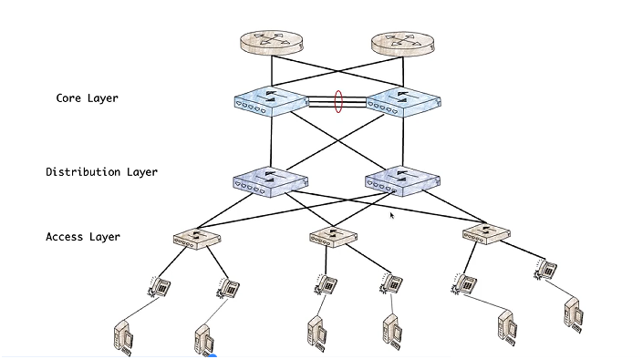

En este ejemplo tenemos las tres capas que comunmente se ponen en empresas grandes

- Access Layer

-Distribuition Layer

-Core Layer

y este es el tipo que combina las 2 capas ( Core y Distribuition Layer) y se utiliza en medianas empresas

- Collapsed Core Layer

- Access Layer

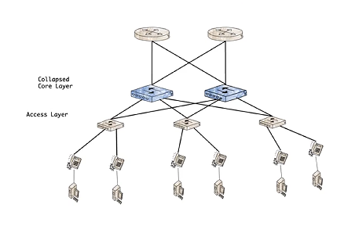

Hay un nueva topologia de diseño de red que se llama 

## **Spine leaf topology** 

-    Leaf (hojas): Son los switches de acceso donde se conectan los servidores, PCs o dispositivos finales.

-   Spine (tronco): Son los switches centrales que interconectan todos los leaf.

No hay conexión directa entre leafs ni entre spines: todo pasa por la estructura tronco-hoja.

**Ventajas**

- Baja latencia: Todos los dispositivos están a máximo 2 saltos de distancia.

- Escalabilidad: Puedes agregar más hojas o más troncos sin rediseñar todo.

- Balanceo de tráfico: El tráfico se distribuye de manera uniforme entre los spines.

- Alta disponibilidad: Si un spine falla, los demás mantienen la comunicación.

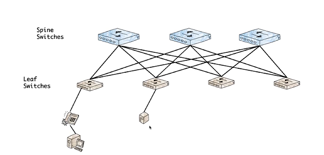

NOTA: > Si quiero ampliar mi ancho de banda para mis ENDPOINTS , debo agregar un SPINE SWITCH

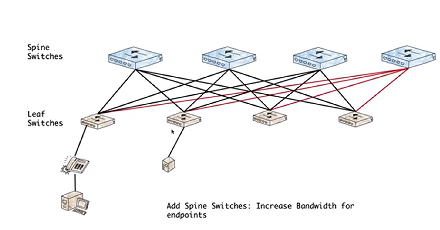

> NOTA: Si agrego Leaf switches eso significa que puedo agregar mas ENDPOINTS

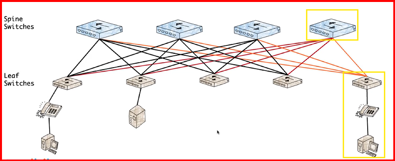

## Cableado

como cabeza tenemos un RJ45 que es el que nos permite conectar a un dispositivo

en el cableado tenemmos dos formas de hacer que se conecten el

568A UTP

568B UTP

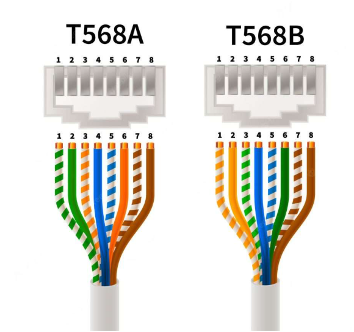

## Straight-through vs Crossover

1. Straight-through: dispositivos distintos — PC a switch, switch a router.

2. Crossover: dispositivos iguales — PC a PC, switch a switch, router a router.

3. Auto-MDIX: los switches modernos detectan automáticamente el tipo de cable. Ya casi no importa cuál uses físicamente, pero el examen pregunta la regla clásica.

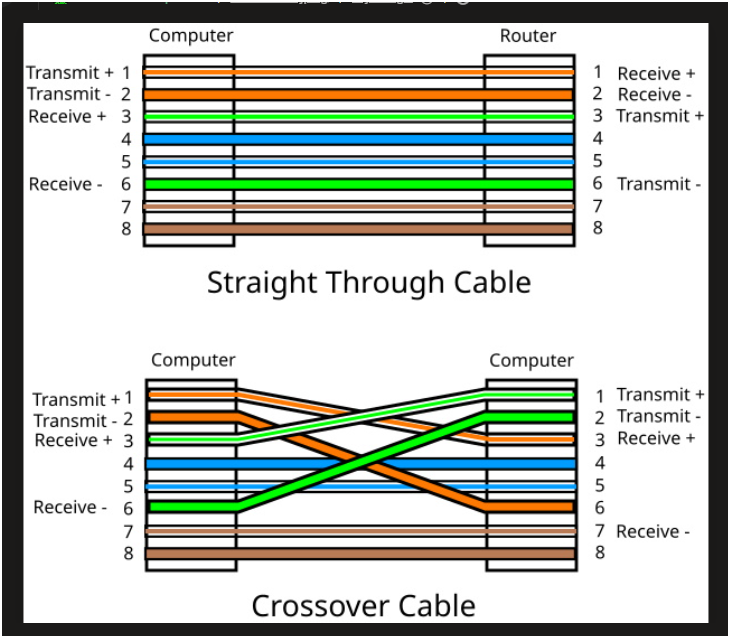

# Fiber Optic

1. Fibra single mode

la monomodo se usa para largas distancias y altas velocidades (hasta más de 100 km)

se usa en: infraestructura de telecomunicaciones, enlaces troncales de Internet, redes metropolitanas, transmisión de datos en larga distancia.

2. Fibra multimode 
multimodo es más económica y práctica para distancias cortas (hasta 1 km aprox.), como en LAN y centros de datos.

se usa en:redes locales (LAN), campus universitarios, centros de datos, sistemas de videovigilancia.

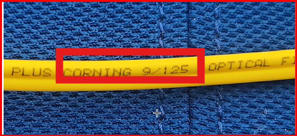

> Nota: al ver los cables por fuera no podemos distinguir a simple vista cual es el de single mode o multimode entonces tenemos las leyendas que traen los cables y con eso sabemos cual es cual

## **CONECTORES DE FIBRA OPTICA**

 - **Conectores de Fibra Óptica**

| Conector | Nombre completo | Características | Usos principales |
|----------|-----------------|-----------------|-----------------|
| **SC**   | Subscriber/Standard Connector | Férula de 2.5 mm, mecanismo push-pull, muy confiable | Redes Ethernet, telecomunicaciones |
| **LC**   | Lucent Connector | Férula de 1.25 mm, más pequeño y moderno | Centros de datos, alta densidad de puertos |
| **FC**   | Ferrule Connector | Conexión por rosca, muy estable | Aplicaciones industriales y de laboratorio |
| **ST**   | Straight Tip | Conexión tipo bayoneta, férula de 2.5 mm | Redes antiguas, educación, pruebas |
| **MPO/MTP** | Multi-fiber Push On / Mechanical Transfer Pull | Conectores para múltiples fibras en un solo cuerpo | Centros de datos, enlaces de alta capacidad |
| **MT-RJ** | Mechanical Transfer Registered Jack | Similar a un RJ-45 pero para fibra | LAN y telecomunicaciones |
| **Otros (E2000, DIN, D4, ESCON, FDDI, SMA)** | Variantes menos comunes | Diseños específicos según estándares | Usos especializados en telecom, industria o legacy |

## ¿Para qué sirven?

**Telecomunicaciones:** interconectar fibras en redes de larga distancia.

**Centros de datos:** alta densidad de conexiones con LC y MPO/MTP.

**LAN y campus:** conexiones multimodo con SC, LC o ST.

**Laboratorios/industria:** conectores FC por su estabilidad mecánica.

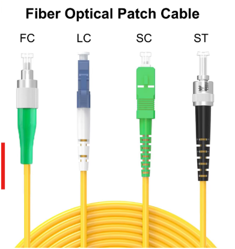

# PoE concepts

**Definición:** Tecnología que permite que los cables de red (Cat5e, Cat6, etc.) transporten energía eléctrica además de datos.

Estándares principales:

**IEEE 802.3af (PoE):** hasta 15.4 W por puerto.

**IEEE 802.3at (PoE+):** hasta 25.5 W por puerto.

**IEEE 802.3bt (PoE++ o 4PPoE):** hasta 60–100 W por puerto.

Componentes involucrados:

**PSE (Power Sourcing Equipment)**: el dispositivo que suministra energía, como un switch PoE o un inyector.

PD (Powered Device): el dispositivo que recibe energía, como una cámara IP, teléfono VoIP o punto de acceso Wi-Fi.

## **Estándares PoE (Power over Ethernet)**

| Estándar      | Nombre        | Potencia máxima por puerto | Aplicaciones típicas |
|---------------|---------------|----------------------------|----------------------|
| **IEEE 802.3af** | PoE        | 15.4 W                     | Teléfonos VoIP, cámaras IP básicas |
| **IEEE 802.3at** | PoE+       | 25.5 W                     | Access Points Wi-Fi, cámaras PTZ |
| **IEEE 802.3bt** | PoE++ / 4PPoE | 60–100 W                 | Pantallas LED, sistemas de videoconferencia, dispositivos IoT avanzados |

## CDP o Cisco Discovery Protocol

**Tipo de protocolo:** Propietario de Cisco, opera en la capa de enlace de datos (OSI Layer 2).

**Función principal:** Descubrir dispositivos vecinos directamente conectados.

**Información que comparte:**

- Nombre del dispositivo (hostname).

- Tipo y número de interfaz (ej. GigabitEthernet0/1).

- Dirección IP del vecino.

- Versión de Cisco IOS.

- Plataforma (modelo de switch o router).

- Capacidades (router, switch, teléfono, etc.).

- Configuración de VLAN (especialmente para teléfonos IP).

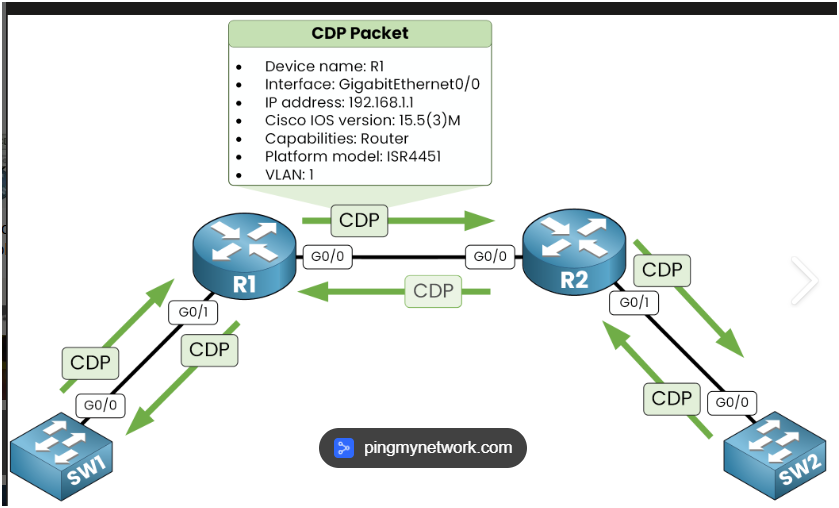

**Cómo funciona**

Mensajes CDP: se envían cada 60 segundos como tramas multicast.

Tiempo de vida (TTL): 180 segundos; si no se recibe actualización, el vecino se elimina de la tabla.

Alcance: solo funciona en interfaces directamente conectadas; no se reenvían paquetes CDP a través de routers.

Versiones:

CDPv1: versión inicial, básica.

CDPv2: añade detección de errores como mismatch de VLAN nativa y mismatch de dúplex.

# Interfaz de red 

**Definición:** Es el medio físico o lógico que conecta un dispositivo a la red (ej. tarjeta de red Ethernet, adaptador Wi-Fi, interfaz virtual en una VM).

## Tipos principales:

**Físicas:** Ethernet (RJ-45), fibra óptica (SC, LC), Wi-Fi.

**Virtuales:** VLAN, túneles VPN, interfaces de máquinas virtuales.

- Componentes clave:

**MAC address:** identificador único.

**Transceptor:** convierte señales digitales en eléctricas, ópticas o radio.

**Driver/firmware:** software que permite al sistema operativo comunicarse con el hardware.

## Problemas comunes en interfaces 

| Problema            | Causa principal                          | Síntomas observables                  | Solución recomendada |
|---------------------|------------------------------------------|---------------------------------------|----------------------|
| Colisiones          | Half-duplex, hubs antiguos               | Retransmisiones, lentitud             | Configurar full-duplex, usar switches |
| Duplex mismatch     | Configuración distinta en cada extremo   | Lentitud, errores de enlace           | Igualar dúplex en ambos extremos |
| Speed mismatch      | Diferencia de velocidad (100 vs 1000)    | Conexión intermitente, baja velocidad | Ajustar velocidad o auto-negociación |
| Cables dañados      | Patch cords doblados o conectores flojos | Desconexiones aleatorias              | Revisar y reemplazar cableado |
| NIC defectuosa      | Tarjeta de red dañada                    | Sin conexión, errores constantes      | Sustituir NIC |
| Puerto defectuoso   | Fallo físico en switch/router            | Dispositivo no conecta                | Cambiar puerto o equipo |
